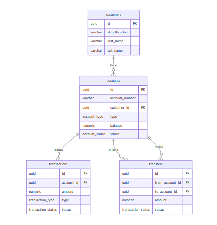

# Database Design — NovoBanco

## 1. SGBD Seleccionado

PostgreSQL 16

### Justificación

1. Soporte ACID completo, necesario para operaciones financieras críticas.
2. Control de concurrencia mediante MVCC, permitiendo múltiples transacciones sin bloquear lecturas.
3. Soporte de constraints avanzados (CHECK, UNIQUE, FK), asegurando integridad a nivel de base de datos.

---

## 2. Modelo de Datos

Se utilizó un modelo relacional normalizado (3FN) para:

- Evitar redundancia
- Mantener integridad
- Facilitar auditoría de transacciones

---

## 3. Decisiones de Diseño

### Saldo
El saldo se almacena en la tabla accounts para optimizar lecturas.

Se garantiza consistencia mediante:
- Transacciones en la aplicación
- CHECK constraint en base de datos (balance >= 0)

---

### Integridad

Se implementaron:
- UNIQUE en account_number y reference
- Foreign keys en todas las relaciones
- CHECK constraints en montos y saldo

---

### Índices

- accounts(account_number) UNIQUE
- transactions(account_id, created_at DESC)
- transactions(reference) UNIQUE
- transfers(from_account_id)
- transfers(to_account_id)

Estos índices permiten consultas eficientes sin full scans.

---

## 4. Soporte a Consultas

### Saldo actual
SELECT balance FROM accounts WHERE account_number = 'X';

### Últimos 20 movimientos
SELECT *
FROM transactions
WHERE account_id = 'X'
ORDER BY created_at DESC
LIMIT 20;

### Transferencias de cliente en 30 días
SELECT COUNT(*)
FROM transfers t
JOIN accounts a ON t.from_account_id = a.id
WHERE a.customer_id = 'Y'
AND t.created_at >= NOW() - INTERVAL '30 days';

### Detección de duplicados
SELECT 1 FROM transactions WHERE reference = 'Z';

---

## 5. Concurrencia

Las operaciones críticas se ejecutan dentro de transacciones de base de datos para garantizar atomicidad y consistencia.

---

## 6. Diagrama ER

---

## 7. Escalabilidad

Para altos volúmenes:
- Particionamiento por fecha en transactions
- Archiving de datos históricos
- Optimización de índices

---

## 8. Conclusión

El diseño prioriza:
- Consistencia
- Trazabilidad
- Simplicidad controlada

Cumpliendo los requerimientos del dominio bancario.
